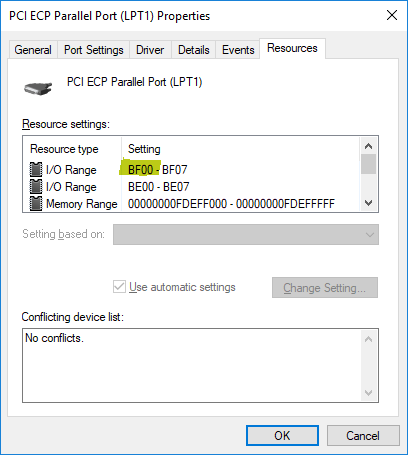

***************************
 Parallel Port Connections
***************************

In Windows, Asteroid Impact can receive incoming trigger pulses over parallel port, and send out pulses as well over a parallel port. Below are notes about how a parallel port works, and how to configure and test for AsteroidImpact

This video describes parallel ports, how they work in windows, and how you can test them in Asteroid Impact. https://www.youtube.com/watch?v=M0jUZ60QPNk

Software Requirements for Parallel Port
=======================================

Parallel ports are only supported in Asteroid Impact on Windows.

Additionally, additional dlls and driver are required. inpout32.dll/inpoutx64.dll must be in the same directory as game.py and the driver needs to be installed. Download all three from the "Binaries Only" link on `Highres.co.uk <http://www.highrez.co.uk/Downloads/InpOut32/default.htm>`_.

Parallel Port Background
=========================

Parallel ports were originally built to send one character at a time over a parallel 8-bit bus to printers. This being a parallel bus means that there are 8 wires for the 8 bits, and some additional wires used to tell the printer "read this byte" and some status wires so your computer can wait until the printer has processed the current byte before sending the next one. When printing your CPU would have to wait until the printer is ready for the next byte before sending it. This is slow, both in the extra waiting your CPU does, and it limits how quickly data can be sent so current printers use USB with controller chips that handle the communication internally.

That said, the 8 output pins and 5 incoming status are useful for lots of hobbyist projects. Parallel ports are still commonly used to drive computer-controlled milling machines because they are easy to interface with without what used to be an expensive controller chip.

I neededed to explain all this because you can't just connect two computers over most parallel port cables because of how the port operates. You need to buy a LapLink cable or wire one.

https://en.wikipedia.org/wiki/Parallel_port

Building a LapLink Cable to connect two computers by parallel ports
====================================================================

Before USB and Wifi were common ways to transfer files, LapLink built software to let you transfer files between two computers using a parallel port cable. I haven't been able to find a LapLink parallel cable for sale, but it is easy to build one yourself. Essentially the cable connects the first 5 data pins to the status pins on the other connector, and vice-versa. Also the logical grounds are connected.

Connect two DB25 male connectors with wires between the pins as follows.

You can also use a DB25 male breakout like this one: https://www.amazon.com/Sysly-Connector-Adapter-Terminal-Riveting/dp/B072FVBR2S/

+----+----+
| 2  | 15 |
+----+----+
| 3  | 13 |
+----+----+
| 4  | 12 |
+----+----+
| 5  | 10 |
+----+----+
| 6  | 11 |
+----+----+
| 10 |  5 |
+----+----+
| 11 |  6 |
+----+----+
| 12 |  4 |
+----+----+
| 13 |  3 |
+----+----+
| 15 |  2 |
+----+----+
| 17 | 19 |
+----+----+
| 18 | 18 |
+----+----+
| 19 | 17 |
+----+----+
| 21 | 21 |
+----+----+
| 22 | 22 |
+----+----+
| 23 | 23 |
+----+----+
| 25 | 25 |
+----+----+

Find parallel port data address in Windows
===========================================

To find the parallel port data address in Windows, do the following.

Bring up the Device Manager. In windows 10 it's fastest to right-click on the start button and choose device manager from the menu.

Find your parallel port under "Ports (COM & LPT)". Double click on it to bring up the properties

On the Resources tab, the first listed "I/O Range" shows the data address in the first number in the range. These numbers are in hexadecimal.

Test parallel port in Asteroid Impact
======================================

Run ``game.py --parallel-test-address ADDRESS`` with ADDRESS is the base data address of your parallel port. Instead of launching the game, a screen will appear showing the current output pin status and input pin status. 

You can click on each of the digits on the output byte to change the value being output on that pin.

If you have a second parallel port in your computer you can wire your LapLink cable between the two parallel ports and launch the game.py twice at once with the two different parallel port addresses to test your LapLink cable and parallel ports.

Note that the BUSY bit on the 8th bit of the status register is inverted, so 0V would read as 1 and 5V would read as a 0.

.. image:: images/parallel-test-screnshot.png

Input trigger behavior
=======================

The input trigger system for keyboard or serial listen and when a particular byte or keypress happens, increments a counter that may advance to the next step if the step's configured number of trigger pulses is set. This is intended to be used to synchronize steps with scanner events.

The parallel port input trigger is used the same way, but watches for a transition from one value, to a second value to indicate that the counter needs to be incremented. This allows you to configure the transition to happen on any particular pin going from 1 to 0 or vice-versa.

The "common" value is the first of the values, then when the value seen is the "active" value the count increases. Run ``game.py --parallel-test-address ADDRESS`` with ADDRESS being the data address of your parallel port to bring up a debug interface that will make it easy to find the values to enter. 

Make sure to enter the hexadecimal values. The hex values are the ones that start with 0x. 

Sample: ::

    "trigger_settings": {
      "mode": "parallel",
    
      "serial_options": {
        "port": "COM5",
        "baudrate": 19200,
        "trigger_byte_value": 53
      },
    
      "keyboard_options": {
        "trigger_key": "K_5"
      },
    
      "parallel_options": {
        "port_address_hex": "BF00",
        "common_status_value_hex": "0x00",
        "trigger_status_value_hex": "0x08"
      }
    },

      
Output trigger behavior
========================

The output trigger system is intended to allow you to record game events mixed with other signals on another computer. Like the input trigger system for parallel ports, the output trigger also specifies a "common" value and "active" value.

For the output triggers you specify a list of game events you want a pulse to be sent on. The full list is in the sample below. 

serial_trigger_strings_by_event is used to specify the list of game events a pulse should be sent on over serial, and what data should be sent on that event. For example, the configuration below sends an ascii digit 1 when each step begins.

parallel_trigger_hex_values_by_event works the same way, but specifies the hex value to set the parallel port output pins to when that event occurs. When multiple parallel port output trigger events happen on the same frame, the changes are combined to happen simultaneously across multiple pins. For example, with an inactive value of 0x00 and a level completion value of 0x01 and difficulty increase value of 0x02 when both happen the output port would be set to 0x03 for the configured number of frames. This logic checks which bits are changed, so it will work active-low as well.

trigger_frames is how many frames (1/60th of second) the parallel port should be kept at the "active" value.

Sample: ::

    "output_trigger_settings": {
      "mode": "parallel",
    
      "serial_trigger_strings_by_event": {
        "step_begin": "1",
        "game_death": "2",
        "game_level_complete": "3",
        "adaptive_difficulty_increase": "4",
        "adaptive_difficulty_decrease": "5"
      },
      "serial_options": {
        "port": "COM6",
        "baudrate": 19200,
        "trigger_byte_value": 78
      },
    
      "parallel_trigger_hex_values_by_event": {
        "step_begin": "0x11",
        "game_death": "0x12",
        "game_level_complete": "0x14",
        "adaptive_difficulty_increase": "0x18",
        "adaptive_difficulty_decrease": "0x00"
      },
      "parallel_options": {
        "port_address_hex": "BF00",
        "common_data_value_hex": "0x10",
        "trigger_frames": 10
      }
    },
