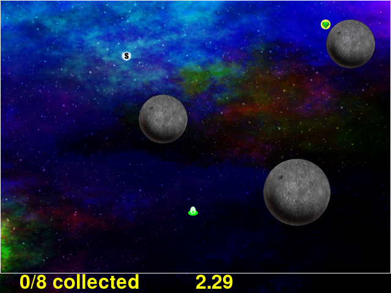
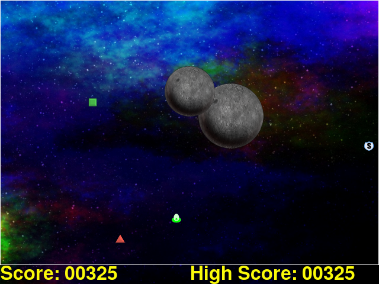

****************************************
Gameplay Step and Adaptive Gameplay Step
****************************************



The ``game`` step is the actual game of Asteroid Impact. The player gets to try to avoid the bouncing asteroids, while collecting crystals to complete the level. There can also be power-ups that slow down the asteroids temporarily or a shield for temporary invulnerability.

The ``game-adaptive`` is a variant of standard gameplay where there isn't a countdown between completed levels. The gameplay is the same.

Both ``game`` and ``game-adaptive`` steps and their configuration are descirbed on this page because they share many options or related options.

JSON Configuration for ``game`` Step
====================================
Below is a sample of the full JSON configuration for a ``game`` step. ::

        {
          "action": "game",
          "levels": "levels/standardlevels.json",
          "duration": 20.0,
          "game_element_opacity": 255,
          "reaction_prompts": [
            {
              "diameter": 80,
              "position_list": [
                [ 400, 200 ]
              ],
              "image": "square.png",
              "sound": "tone146.wav",
              "showtimes_millis": [],
              "showtimes_trigger_counts": [ 1, 2, 3, 4, 5, 6 ],
              "input_key": "K_MOUSE1",
              "timeout_millis": "never",
              "stay_visible": false
            }
          ]
        },


``"duration"``
    The number of seconds to show the step for. When omitted, gameplay will continue until the game is forced to quit with alt+f4 or cmd+q.
``"trigger_count"``
    The number of incoming trigger pulses until this step automatically advances. When omitted, gameplay will continue until the game is forced to quit with alt+f4 or cmd+q.
``"levels"``
    The filename for the JSON file with the list of levels. See :doc:`makelevelpy` for information about creating levelss, and :doc:`leveljson` for information about the JSON format for levels themselves.
``"game_element_opacity"``
    The apparent opacity of the game elements, from 0 (completely invisible) to 255 (fully opaque, default). 64 is pretty dim but still sort of playable.


JSON Configuration for ``game-adaptive`` Step
=============================================
The ``game-adaptive`` step has the same settings as ``game`` except levels work differently for the creation during gameplay. Below is a sample of the full JSON configuration for a ``game-adaptive`` step. ::

        {
          "duration": 10.0,
          "action": "game-adaptive",
          "start_level": 0.5,
          "level_completion_increment": 0.3,
          "level_death_decrement": 0.4,
          "continuous_asteroids_on_same_level": false,
          "adaptive_asteroid_size_locked_to_initial": false,
          "show_advance_countdown": false,
          "game_element_opacity": 255,
          "level_templates": [
            {
              "asteroid_count": 1,
              "asteroid_speeds": "slow",
              "powerup_count": 0,
              "target_count": 3
            },
            {
              "asteroid_count": 3,
              "asteroid_sizes": "varied",
              "asteroid_speeds": "medium",
              "powerup_count": 10,
              "powerup_delay": 0.5,
              "powerup_types": [
                "slow"
              ],
              "target_count": 3
            },
            {
              "asteroid_count": 8,
              "asteroid_sizes": "varied",
              "asteroid_speeds": "medium",
              "powerup_count": 10,
              "powerup_delay": 2.0,
              "powerup_types": [
                "slow",
                "shield"
              ],
              "target_count": 3
            },
            {
              "asteroid_count": 5,
              "asteroid_speeds": "extreme",
              "powerup_count": 10,
              "powerup_delay": 0.5,
              "powerup_types": [
                "shield"
              ],
              "target_count": 3
            }
          ]
        },


``"duration"``
    The number of seconds to show the step for. When omitted, gameplay will continue until the game is forced to quit with alt+f4 or cmd+q.
``"trigger_count"``
    The number of incoming trigger pulses until this step automatically advances. When omitted, gameplay will continue until the game is forced to quit with alt+f4 or cmd+q.
``"start_level"``
    The initial "level" when starting. See the section below for how the player advances into the next level. 0.0 would start the player on the first level, 1.0 the second level and so-on.
``"level_completion_incrment"``
    When the player completes a level without dying, their current "level score" is increased by this amount. This would typically be between 0.1 and 1.0.
``"level_death_decrement"``
    When the player dies and fails to complete a level, their "level score" is reduced by this amount. See the "level score" section below.
``"continuous_asteroids_on_same_level"``
    When the player dies or picks up enough crystals to change the "level score", it doesn't always advance to the next more or less difficult level. When ``"continuous_asteroids_on_same_level"`` is set to true, and they don't advance to the next or previous level the asteroids continue moving in the same pattern with the same sizes they had before. This defaults to ``false``.
``"adaptive_asteroid_size_locked_to_initial"``
    Instead of allowing the asteroids to change size on level transitions, when this is ``true`` asteroids are stuck at the size they are first shown with. New asteroids can continue to appear with their own size, asteroids can still go away if the level has fewer asteroids. This defaults to ``false``.
``"show_advance_countdown"``
    When ``true`` and the player advances to the next more difficult level, they are invulnerable for a few seconds while the beginning-of-level countdown happens again. This defaults to ``false``
``"levels"``
    This is either a filename for a JSON file that contains the list of adaptive level parameters (which aren't compatible with the normal gameplay level options) or is the list itself. The "Adaptive Level Options" section below describes the options in more detail.
``"game_element_opacity"``
    The apparent opacity of the game elements, from 0 (completely invisible) to 255 (fully opaque, default). 64 is pretty dim but still sort of playable.

Level Score
___________
Where the normal gameplay would show you the same level again you touch an asteroid and fail, and next level when you complete the level, the adaptive mode doesn't have to work this way. Instead you advance a fractional amount, or fall back a fractional amount.

These are configurable. Your "level score" starts at ``"start_level"`` where 0.0 to 0.99 is the first level in the list, 1.0 through 1.99 is the second level and so-on.

Each time you complete a level your "level score" is increased by ``"level_completion_increment"``, and when you touch an asteroid and die your "level score" is decreased by ``"level_death_decrement"``.

So this can be configured to act like the normal gameplay, with increment of 1.0 and decrement of 0.0, but this configuration exists because I felt that would ratchet the difficutly up to the point where you fail continuously, instead of you reaching a happy flow state where you make a few mintues of progress before being set back some.

Multicolor Crystal Scoring
__________________________

The game-adaptive mode has a new alternate means of gameplay that changes how crystals work. Where in the standard modes crystals have one appearance, stay visible until you collect them, and appear only when the previous crystal is collected, this mode changes things.



The normal green diamond on yellow circle crystal does not appear, instead the crystals are the 5 listed below. The numbers are the numbers used for configuration below.

 1. Red triangle crystal
 2. Green square crystal
 3. Yellow diamond crystal
 4. Orange hexagon crystal
 5. Blue octagon crystal

Next, a score appears on the bottom of the screen. When a crystal is collected, the configurable amount added to the score depends not just on the color of the crystal collected, but on the color of the one last collected. This allows scores such as "25 points for every crystal collected except 0 when collecting the same color twice in a row"

To allow the player to choose which order they want to collect crystals in, crystals can be configured expire after a few seconds on their own, and/or more than one crystal can be visible at a time.

The "Level Score" continues to apply as before. After the player collects the level-specific ``"target_count"`` they may be advanced to the next more difficult level if the "Level Score" is incremented high enough.

Below is a sample script JSON will all multicolor crystal scoring options specified ::

    {
      "steps": [
        {
          "action": "game-adaptive",
          "start_level": 3.5,
          "level_completion_increment": 0.4,
          "level_death_decrement": 0.3,
          "continuous_asteroids_on_same_level": false,
          "show_advance_countdown": false,
          "game_element_opacity": 255,
    
          "multicolor_crystal_scoring": true,
          "multicolor_crystal_numbers": [ 1, 2, 3, 4, 5 ],
          "multicolor_crystal_num_showing": 2,
          "multicolor_crystal_lifetime_ms": 5000,
    
          "multicolor_crystal_score_table": [
            [ 25, 25, 25, 25, 25, 25 ],
            [ 50, 50, 50, 50, 50, 50 ],
            [ 100, 100, 100, 100, 100, 100 ],
            [ 200, 200, 200, 200, 200, 200 ],
            [ 500, 500, 500, 500, 500, 500 ]
          ],
    
          "level_templates": [
            {
              "asteroid_count": 1,
              "asteroid_speeds": "slow",
              "powerup_count": 0,
              "target_count": 1
            },
            {
              "asteroid_count": 1,
              "asteroid_speeds": "medium",
              "powerup_count": 0,
              "target_count": 2
            },
            {
              "asteroid_count": 3,
              "asteroid_sizes": "varied",
              "asteroid_speeds": "medium",
              "powerup_count": 10,
              "powerup_delay": 0.5,
              "powerup_types": [
                "slow"
              ],
              "target_count": 3
            },
            {
              "asteroid_count": 3,
              "asteroid_sizes": "varied",
              "asteroid_speeds": "slow",
              "powerup_count": 10,
              "powerup_delay": 0.5,
              "powerup_types": [
                "slow"
              ],
              "target_count": 4
            },
            {
              "asteroid_count": 2,
              "asteroid_speeds": "medium",
              "powerup_count": 10,
              "powerup_delay": 0.5,
              "powerup_types": [
                "shield"
              ],
              "target_count": 5
            },
            {
              "asteroid_count": 3,
              "asteroid_speeds": "medium",
              "powerup_count": 10,
              "powerup_delay": 0.5,
              "powerup_types": [
                "shield"
              ],
              "target_count": 3
            },
            {
              "asteroid_count": 3,
              "asteroid_speeds": "medium",
              "powerup_count": 10,
              "powerup_delay": 0.5,
              "powerup_types": [
                "slow"
              ],
              "target_count": 3
            },
            {
              "asteroid_count": 2,
              "asteroid_speeds": "fast",
              "powerup_count": 10,
              "powerup_delay": 0.5,
              "powerup_types": [
                "slow"
              ],
              "target_count": 3
            },
            {
              "asteroid_count": 4,
              "asteroid_sizes": "medium",
              "asteroid_speeds": "medium",
              "powerup_count": 10,
              "powerup_delay": 2.0,
              "powerup_types": [
                "slow",
                "shield"
              ],
              "target_count": 3
            },
            {
              "asteroid_count": 4,
              "asteroid_sizes": "medium",
              "asteroid_speeds": "fast",
              "powerup_count": 10,
              "powerup_delay": 2.0,
              "powerup_types": [
                "slow",
                "shield"
              ],
              "target_count": 3
            },
            {
              "asteroid_count": 6,
              "asteroid_sizes": "small",
              "asteroid_speeds": "medium",
              "powerup_count": 10,
              "powerup_delay": 2.0,
              "powerup_types": [
                "slow",
                "shield"
              ],
              "target_count": 3
            },
            {
              "asteroid_count": 8,
              "asteroid_sizes": "varied",
              "asteroid_speeds": "medium",
              "powerup_count": 10,
              "powerup_delay": 2.0,
              "powerup_types": [
                "slow",
                "shield"
              ],
              "target_count": 3
            },
            {
              "asteroid_count": 5,
              "asteroid_speeds": "extreme",
              "powerup_count": 10,
              "powerup_delay": 0.5,
              "powerup_types": [
                "shield"
              ],
              "target_count": 3
            }
          ]
        }
      ]
    }


The multicolor-specific options are as follows:

``"multicolor_crystal_scoring"``
    Set this to ``true`` to enable the new multicolor scoring behaviors.
``"multicolor_crystal_numbers"``
    Set this to a list of numbers 1-5 corresponding to the crystal colors you want to see on this step. For example, if you want to see only the red triangle and orange hexagon, use ``"multicolor_crystal_numbers": [1, 4],``. If not specified, defaults to just shwoing the red triangle.
``"multicolor_crystal_num_showing"``
    The number of crystals to have active on screen at a time. To show two crystals on screen at all times, set this to ``2``. This defaults to ``1``.
``"multicolor_crystal_lifetime_ms"``
    The duration in milliseconds a crystal remains before it goes away on its own. Leave out this option, or set it to ``null`` make the crystals persistent forever. Set to ``5000`` to make crystals automatically go away after 5 seconds.
``"multicolor_crystal_score_table"``
    5 rows of point values, with 6 scores per row. This is a table used to find the number of points to award when a crystal is collected. The row corresponds to the color of the crystal the player is collecting now, such as the red triangle for the first row. The entry within the inner list corresponds to the color of the previously selected crystal, for example the first inner points value corresponds to having previously collected a red triangle. The 6th points value is used when no crystal was collected previously.


Here's a score table that always awards 25 points for red triangle, 50 for green square and so-on. ::

      "multicolor_crystal_score_table": [
        [ 25, 25, 25, 25, 25, 25 ],
        [ 50, 50, 50, 50, 50, 50 ],
        [ 75, 75, 75, 75, 75, 75 ],
        [ 100, 100, 100, 100, 100, 100 ],
        [ 125, 125, 125, 125, 125, 125 ]
      ],


Here's the same table as above, modified to award 0 points when you collect the same color after itself ::

      "multicolor_crystal_score_table": [
        [ 0, 25, 25, 25, 25, 25 ],
        [ 50, 0, 50, 50, 50, 50 ],
        [ 75, 75, 0, 75, 75, 75 ],
        [ 100, 100, 100, 0, 100, 100 ],
        [ 125, 125, 125, 125, 0, 125 ]
      ],


And here's another table that awards 10 points for everything, and 500 points when you collect a green square after a red triangle. ::

      "multicolor_crystal_score_table": [
        [ 10, 10, 10, 10, 10, 10 ],
        [ 500, 10, 10, 10, 10, 10 ],
        [ 10, 10, 10, 10, 10, 10 ],
        [ 10, 10, 10, 10, 10, 10 ],
        [ 10, 10, 10, 10, 10, 10 ]
      ],


Level List Options
__________________

The adaptive gameplay level list entries have the following options:

``"target_count"``
   Number of crystals to pick up to complete the level.
``"asteroid_count"``
    Number of asteroids.
``"asteroid_speeds"``
   ``"slow"``, ``"medium"``, ``"fast"`` or ``"extreme"`` speed for asteroids.
``"asteroid_sizes"``
    ``"small"``, ``"medium"``, ``"large"`` or ``"varied"`` sizes of asteroids.
``"powerup_count"``
    Number of different power-ups available for the player to pick up.
``"powerup_initial_delay"``
    Number of seconds until the first power-up is available after the level begins.
``"powerup_delay"``
    Delay between when one power-up is used and when the next appears, in seconds.
``"powerup_types"``
    The types of power-ups to make available. ``"shield"``, ``"slow"``, ``"all"`` or ``"none"``
``"seed"```
    Number used to seed the random number generator that chooses sizes, positions, and speeds of targets, asteroids, and power-ups. This is automatically auto-generated from a hash of the other level parameters if omitted. May be any number.

Reaction Prompt
===============
Both the ``game`` and ``game-adaptive`` steps have additional reaction-time prompts that can be configured to show on top of normal gameplay.


JSON Configuration options for Reaction Prompts
===============================================
The reaction prompt configuration is optional if you don't want them to appear for you. If you do, the details of their structure is described below.

the ``reaction_prompts`` list is filled with entries like the one below ::

    {
      "diameter": 80,
      "position_list": [
        [ 300, 200 ],
        [ 600, 400 ]
      ],
      "image": "circle.png",
      "sound": "tone659.wav",
      "showtimes_millis": [ 1500, 3500 ],
      "showtimes_trigger_counts": [ 1, 3 ],
      "input_key": "K_2",
      "timeout_millis": 1500,
      "stay_visible": false,
      "score_pass": 100,
      "score_fail": -90,
      "score_miss": -10
    }

``"diameter"``
    The diameter (width and height) of the image shown on screen in game units. If the window is 640x480 then 100 units diameter would result in the image appearing 40px wide on screen.
``"position_list"``
    List of positions the reaction prompt should appear on screen. Each entry should be a 2-element list of numbers, representing the game coordinate for the left edge and top edge of the prompt on screen. The first time the prompt appears it will be at the first listed position, second appearance at the second entry and so-on. If the list is exhausted the next appearance will start at the beginning again. If you'd like, you can position the prompt off screen, or omit the list of positions and change the ``image`` to ``"none"``.
``"image"``
    The filename for the graphic to be used to represent the reaction prompt. ``"circle.png"``, ``"square.png"`` and ``"triangle.png"`` are included in the data folder for this purpose, but feel free to add your own. You may also specify ``"none"`` to show no image.
``"sound"``
    The sound file to play while active. This can be ``"none"`` for no sound file. The game includes 3 tones: ``"tone146.wav"``, ``"tone440.wav"`` and ``"tone659.wav"``
``"showtimes_millis"``
    [when to show]
``"showtimes_trigger_counts"``
    [when the current step receives the Nth trigger pulse, show the reaction prompt]
``"timeout_millis"``
    After this duration the prompt will go away on its own. Set to ``"none"`` to continue showing/sounding the reaction prompt
``"stay_visible"``
    ``true`` to have the image and sound continue playing for the entire ``timeout_millis`` duration.
``"score_pass"``
    Integer number of points to award (or negative to subtract) when prompt is responded to with the correct key in time. The score is only shown when enabled for the multicolor crystal scoring. Leave out this option, or specify a value of null to not add or subtract any points.
``"score_fail"``
    Integer number of points to award (or negative to subtract) when prompt is responded to with the incorrect key or too late. The score is only shown when enabled for the multicolor crystal scoring. Leave out this option, or specify a value of null to not add or subtract any points.
``"input_key"``
    is the name of the keyboard key or mouse button the player should press in response to this reaction prompt. The options are in the list below.

::

    K_MOUSE1 -- Left mouse button
    K_MOUSE2 -- Middle mouse button
    K_MOUSE3 -- Right mouse button
    K_0 through K_9
    K_AMPERSAND
    K_ASTERISK
    K_AT
    K_BACKQUOTE
    K_BACKSLASH
    K_BACKSPACE
    K_BREAK
    K_CAPSLOCK
    K_CARET
    K_CLEAR
    K_COLON
    K_COMMA
    K_DELETE
    K_DOLLAR
    K_DOWN
    K_END
    K_EQUALS
    K_ESCAPE
    K_EURO
    K_EXCLAIM
    K_F1 through K_F15
    K_FIRST
    K_GREATER
    K_HASH
    K_HELP
    K_HOME
    K_INSERT
    K_KP0 through K_KP9
    K_KP_DIVIDE
    K_KP_ENTER
    K_KP_EQUALS
    K_KP_MINUS
    K_KP_MULTIPLY
    K_KP_PERIOD
    K_KP_PLUS
    K_LALT
    K_LAST
    K_LCTRL
    K_LEFT
    K_LEFTBRACKET
    K_LEFTPAREN
    K_LESS
    K_LMETA
    K_LSHIFT
    K_LSUPER
    K_MENU
    K_MINUS
    K_MODE
    K_NUMLOCK
    K_PAGEDOWN
    K_PAGEUP
    K_PAUSE
    K_PERIOD
    K_PLUS
    K_POWER
    K_PRINT
    K_QUESTION
    K_QUOTE
    K_QUOTEDBL
    K_RALT
    K_RCTRL
    K_RETURN
    K_RIGHT
    K_RIGHTBRACKET
    K_RIGHTPAREN
    K_RMETA
    K_RSHIFT
    K_RSUPER
    K_SCROLLOCK
    K_SEMICOLON
    K_SLASH
    K_SPACE
    K_SYSREQ
    K_TAB
    K_UNDERSCORE
    K_UP
    K_a through K_z


