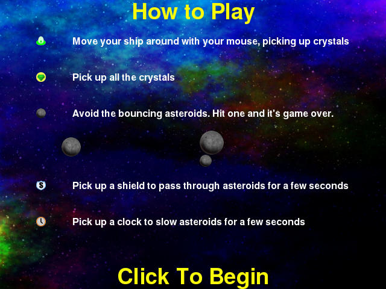

*****************
Instructions Step
*****************

The Instructions step displays information about the game elements and how to play Asteroid Impact.

JSON Configuration for Instructions Step
========================================

Below is sample JSON for a instructions step will all the options specified.

::

        {
            "action": "instructions",
            "duration": 30.0,
            "trigger_count": 10
        },

``duration``
   The number of seconds to show the step for. When omitted, a "Click to continue" prompt is added below the bottom option that allows the player to advance to the next step when they are ready.
``trigger_count``
    The number of incoming trigger pulses until this step automatically advances. When omitted, a "Click to continue" prompt is added below the bottom option that allows the player to advance to the next step when they are ready.

