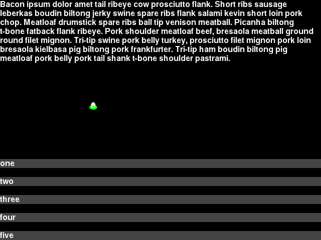

***********
Survey Step
***********

The Survey step prompts the participant to choose the answer from a pre-determined list of answers.

The prompt, and list of answers are configurable.

JSON Configuration for Survey Step
==================================

Below is sample JSON for a survey step will all the options specified.

::

        {
            "action": "survey",
            "duration": 30.0,
            "trigger_count": 10,
            "prompt": "This is the prompt. This is the prompt. This is the prompt. This is the prompt.",
            "options": ["one","two","three","four","five"]
        },

``duration``
   The number of seconds to show the step for. When omitted, a "Next" button is added below the bottom option that allows the player to advance to the next step.
``trigger_count``
    The number of incoming trigger pulses until this step automatically advances. See :doc:`Trigger Inputs <input-trigger>` for how to configure input triggers. When omitted, a "Next" button is added below the bottom option that allows the player to advance to the next step.
``prompt``
   The survey question. This can contain newlines and blank lines and will display them. No other special formatting is available.
``options``
   The list of options to choose from. There isn't a hard limit on number but they can end up overlapping the prompt or going off screen. The text you enter will be clipped if it is too long to fit on screen.

Per-frame log
=============

The per-frame CSV log created with the `--log-filename FILENAME` command-line switch has two columns for the state of the survey question step.

``survey_answer``
    The text of the selected survey answer
``survey_prompt``
    The question/prompt text shown to the player on the current survey step.

The per-frame log records one row per-frame so will record rows before the player has selected an answer, and will also record every answer they selected before advancing on to the next step.

Survey log file
===============

The players choices for survey questions can also be saved in a CSV file that saves one row per survey question step completed. Run the game with the ``--survey-log-filename SURVEY_LOG_FILENAME`` command-line switch to save the survey question responses for the current participant to the CSV file named ``SURVEY_LOG_FILENAME``.

The full list of columns in this file are the following:

``subject_number``
    from ``--subject-number SUBJECT_NUMBER`` command-line switch
    [other normal columns here]
``subject_run``
    from ``--subject-run SUBJECT_RUN`` command-line switch
``total_millis``
    number of milliseconds since the game was started when the survey step ended
``step_number``
    number of survey step that was completed from list in JSON file specified to ``--script-json SCRIPT_JSON`` file.
``step_millis``
    duration in milliseconds it took to complete the survey question and advance to the next step.
``step_trigger_count``
    the count of incoming trigger pulses (serial or keyboard) that elapsed during this step.
``top_screen``
    name of the screen that was topmost at the completion of the survey step. This should always be "Survey"
``survey_prompt``
    The prompt configured in the survey question step JSON.
``survey_answer``
    The selected answer chosen by the player.

