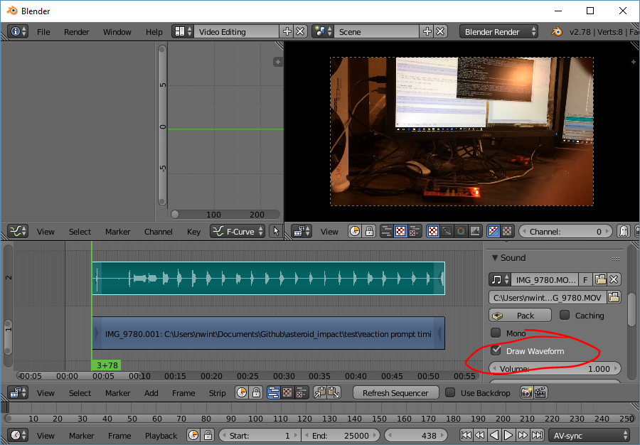
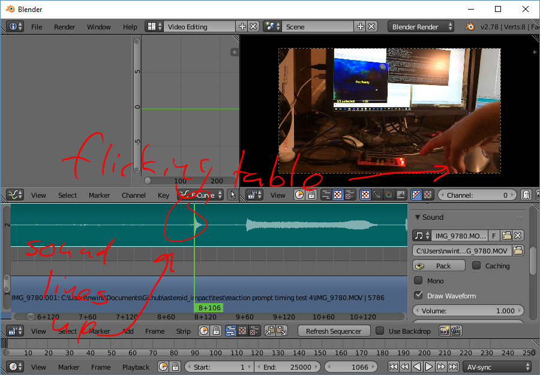
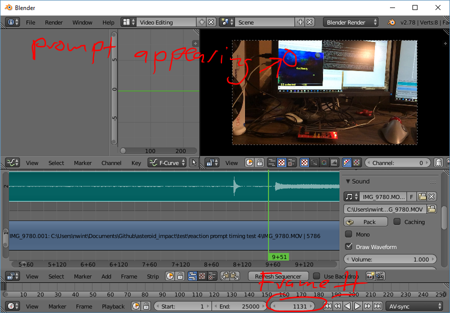

***********
Game Timing
***********

This page descirbes how time passes in Asteroid Impact, and how the recorded values may not match what the player experiences.

Game Loop
=========

Asteroid Impact's internal game loop works as follows:

 * Wait for current time to reach next increment of 16ms using pygame.time.Clock.tick_busy_loop which keeps the CPU busy
 * Do input processing
 * Update game elements
 * Redraw screen
 * Loop

What this means in practice is that the game should report every frame happened 16ms after the previous frame. Also, because pygame doesn't have a mechanism to synchronize with the display vertical sync the frames will not consistently equal the display refresh.

Input and Display Latency
=========================

There is a measurable amount of time between when a key is pressed and when the game is notified of the key being pressed. There is also a measurable amount of time beetween when the game considers the frame "rendered" and the pictured image on a screen or projector changes.

The typical latency between when a key is pressed, it's processed by the game, and a different set of pixels appear on screen can vary from 30ms to 150ms or more depending on your keyboard, graphics card, display and video processing settings.

I've described how to measure your input latency using a 120fps capable camera (such as a recent smartphone or gopro) and an Arduino Leonardo acting as a keyboard. This is described in the next section.

Measuring Input and Display Latency
===================================

Because the input and display latency vary with different monitors and settings, below is a description of how you can measure it for yourself.

You need:

 * Your computer to test, preferably with speakers so you can measure audio lag also.
 * Something to act as a keyboard that lights up when a key is pressed. I used an Arduino Leonardo and Sparkfun Danger Shield but you might want a Adafruit Proto Shield or just a breadboard and wires.
 * A video camera that can record 120fps or higher. Recent smart phones in "slow motion" are fine. Same with recent GoPro.
 * A tripod would be helpful but is not required.

The process is roughly as follows:

 1. Configure a batch file to run the game saving a log file for every frame, and for in game reaction prompts.
 2. Record video of the display and your "light-up keyboard", as well as clapping a couple times in front of the camera.
 3. Manually record the frames that keys were pressed and the reaction prompts showed up and disappeared from the screen.
 4. Manually record the offset between the clap sound and the hands coming together.
 5. Manually record the frame numbers where the reaction prompt sound starts

Arduino Leonardo Sketch ::

    /*
      Keyboard test, lights LEDs when keyboard butons are pressed
    
      inputs press 1, 2, or 3 key on keyboard.
    
      Note if you hold the buttons down the keys will repeat.
    
      Circuit:
      - Arduino Leonardo or Micro
      - wire to connect D2 to ground
    */
    
    #include "Keyboard.h"
    
    int but_pin_1 = 10;
    int but_pin_2 = 11;
    int but_pin_3 = 12;
    int led_pin_1 = 6;
    int led_pin_2 = 5;
    int led_pin_3 = 13;
    
    void setup() {
      // make but_pin_1 an input and turn on the pull-up resistor so it goes high unless
      // connected to ground:
      pinMode(but_pin_1, INPUT_PULLUP);
      pinMode(but_pin_2, INPUT_PULLUP);
      pinMode(but_pin_3, INPUT_PULLUP);
      pinMode(led_pin_1, OUTPUT);
      pinMode(led_pin_2, OUTPUT);
      pinMode(led_pin_3, OUTPUT);
      digitalWrite(led_pin_1, LOW);
      digitalWrite(led_pin_2, LOW);
      digitalWrite(led_pin_3, LOW);
      Keyboard.begin();
    }
    
    void loop() {
      // wait a couple seconds before starting after reset:
      delay(5000);
    
      while(true) {
        if (digitalRead(but_pin_1) == LOW) {
          Keyboard.press('1');
          digitalWrite(led_pin_1, HIGH);
          delay(500);
          digitalWrite(led_pin_1, LOW);
          Keyboard.releaseAll();
        } else if (digitalRead(but_pin_2) == LOW) {
          Keyboard.press('2');
          digitalWrite(led_pin_2, HIGH);
          delay(500);
          digitalWrite(led_pin_2, LOW);
          Keyboard.releaseAll();
        } else if (digitalRead(but_pin_3) == LOW) {
          Keyboard.press('3');
          digitalWrite(led_pin_3, HIGH);
          delay(500);
          digitalWrite(led_pin_3, LOW);
          Keyboard.releaseAll();
        }
      }
    }

Test script JSON: ``lagtest.json`` ::

    {
      "steps": [
        {
          "duration": 500.5,
          "action": "game",
          "levels": "levels/standardlevels.json",
          "reaction_prompts": [
            {
              "diameter": 80,
              "position_list": [
                [ 200, 200 ]
              ],
              "image": "triangle.png",
              "sound": "tone440.wav",
              "showtimes_millis": [ 1000, 3000, 5000, 7000, 9000, 11000, 13000, 15000, 17000, 19000, 21000, 23000, 25000, 27000, 29000, 31000, 33000, 35000, 37000, 39000, 41000, 43000, 45000, 47000, 49000, 51000, 53000, 55000, 57000, 59000, 61000, 63000, 65000, 67000, 69000, 71000, 73000, 75000, 77000, 79000, 81000, 83000, 85000, 87000, 89000, 91000, 93000, 95000, 97000, 99000, 101000, 103000, 105000, 107000, 109000, 111000, 113000, 115000, 117000, 119000, 121000, 123000, 125000, 127000, 129000, 131000, 133000, 135000, 137000, 139000, 141000, 143000, 145000, 147000, 149000, 151000, 153000, 155000, 157000, 159000, 161000, 163000, 165000, 167000, 169000, 171000, 173000, 175000, 177000, 179000, 181000, 183000, 185000, 187000, 189000, 191000, 193000, 195000, 197000, 199000 ],
              "showtimes_trigger_counts": [],
              "input_key": "K_1",
              "timeout_millis": 1500,
              "stay_visible": false,
              "fail_on_wrong_key": false,
              "pass_fail_sounds": false
            }
          ]
        }
      ]
    }

Execute batch file: ::

    python game.py --music-volume 0.0 --script-json "%~dp0\lagtest.json" --window-x 0 --window-y 596 --effects-volume 0.5 --reaction-log "%~dp0\reactions-calibration.csv" --log-filename "%~dp0\log.csv"

The video recording
===================

Frame your camera so both your "light-up keyboard" and display are in focus and looking good. Make sure your camera is in the slow motion mode when you do this because the cropping changes in different modes.

Start recording, clap in view of the camera, then press your "keyboard" button in response to each reaction prompt.

Processing the video
====================

I reviewed the video in Blender because I'm familiar with it and it lets me step through the video frame by frame with the audio waveform besides. I'm sure a video editing tool would allow the same, but I don't have experience with Premiere or similar to know how to make it work with 120fps video. This isn't a full introduction to the Blender UI because I expect you to either be familiar with it, or another video editing tool to get the same results.

From a new file:
 1. Change the resolution scale to 100%
 2. Change the framerate to your video framerate
 3. Switch from the default screen layout to video editing

.. image:: images/reaction-timing-blender-1.PNG

Then:

 4. Load your video file (add->movie then browse to it)
 5. Rotate your video if needed (flip both x and y to rotate 180 degrees). Right click on the lower (blue) track to select it first.
 6. Zoom with ctrl+mmb in video window. Zooming is in two different directions so you can make the waveform visible and the reaction prompt tone take up enough screen space.
 7. Turn on the audio waveform on the audio track. Right click on it to select it, then turn on "Draw Waveform" option.

.. image:: images/reaction-timing-blender-2.PNG

Next you can use the left/right arrow keys when the cursor is above the video window to go to the previous/next frames.

The important things to measure are:

 * The delay between hands hitting in a clap, and the audio peak. This is the offset of the two in your recorded video.
 * The delay between when the reaction prompt key is pressed and when it disappears from the screen. This has the same duration as the input latency, and is also how much extra time is recorded with every reaction time prompt to the log.
 * The delay between when the reaction prompt appears on screen and the tone is heard. This, when corected for your recording audio offset, is your audio lag.

Input and Display Latency Results
=================================

First test was with:

 * Desktop with Intel i7 7700k Running Windows 10 1703
 * Nvidia GTX 1070 graphics card
 * Dell U2211H display connected via DisplayPort
 * Onboard Realtek Audio
 * Car speakers amplified with cheap TPA3116D2 amplifier
 * "keyboard" for this was an Arduino Leonardo with Sparkfun Danger Shield for button and LED

Results:
Audio as recorded was 9 frames behind video. (When clapping, the hands touched 9 frames before the sound)

Video was recorded at 120FPS on iPhone 5S, so video times have a resolution of about 8.3ms.

+------------------------------------+-----------------------------------+----------------------------+---------------------------------+-------------------------------+
| reaction_prompt_millis in game log | Video measured reaction time (ms) | video reaction time  - log | keyboard to LCD update delay ms | Video Prompt audio delay (ms) |
+====================================+===================================+============================+=================================+===============================+
|                                304 |                             258.3 |                      -45.7 |                            41.7 |                          16.7 |
+------------------------------------+-----------------------------------+----------------------------+---------------------------------+-------------------------------+
|                                304 |                             258.3 |                      -45.7 |                            41.7 |                          16.7 |
+------------------------------------+-----------------------------------+----------------------------+---------------------------------+-------------------------------+
|                                288 |                             241.7 |                      -46.3 |                            41.7 |                          16.7 |
+------------------------------------+-----------------------------------+----------------------------+---------------------------------+-------------------------------+
|                                288 |                             241.7 |                      -46.3 |                            41.7 |                          25.0 |
+------------------------------------+-----------------------------------+----------------------------+---------------------------------+-------------------------------+
|                                176 |                             125.0 |                      -51.0 |                            41.7 |                          25.0 |
+------------------------------------+-----------------------------------+----------------------------+---------------------------------+-------------------------------+
|                                176 |                             125.0 |                      -51.0 |                            41.7 |                          16.7 |
+------------------------------------+-----------------------------------+----------------------------+---------------------------------+-------------------------------+
|                                240 |                             191.7 |                      -48.3 |                            41.7 |                          16.7 |
+------------------------------------+-----------------------------------+----------------------------+---------------------------------+-------------------------------+
|                                224 |                             175.0 |                      -49.0 |                            41.7 |                          25.0 |
+------------------------------------+-----------------------------------+----------------------------+---------------------------------+-------------------------------+
|                                256 |                             200.0 |                      -56.0 |                            50.0 |                          25.0 |
+------------------------------------+-----------------------------------+----------------------------+---------------------------------+-------------------------------+
|                                128 |                              75.0 |                      -53.0 |                            41.7 |                          16.7 |
+------------------------------------+-----------------------------------+----------------------------+---------------------------------+-------------------------------+

The second test was the same, except the sound card was replaced with a cheap 2-channel out microphone in generic USB sound adapter.

+------------------------------------+-----------------------------------+----------------------------+---------------------------------+-------------------------------+
| reaction_prompt_millis in game log | Video measured reaction time (ms) | video reaction time  - log | keyboard to LCD update delay ms | Video prompt audio delay (ms) |
+====================================+===================================+============================+=================================+===============================+
|                                912 |                             866.7 |                      -45.3 |                            41.7 |                          33.3 |
+------------------------------------+-----------------------------------+----------------------------+---------------------------------+-------------------------------+
|                                544 |                             500.0 |                      -44.0 |                            33.3 |                          16.7 |
+------------------------------------+-----------------------------------+----------------------------+---------------------------------+-------------------------------+
|                                368 |                             316.7 |                      -51.3 |                            50.0 |                          33.3 |
+------------------------------------+-----------------------------------+----------------------------+---------------------------------+-------------------------------+
|                                320 |                             275.0 |                      -45.0 |                            41.7 |                          16.7 |
+------------------------------------+-----------------------------------+----------------------------+---------------------------------+-------------------------------+
|                                320 |                             266.7 |                      -53.3 |                            50.0 |                          16.7 |
+------------------------------------+-----------------------------------+----------------------------+---------------------------------+-------------------------------+
|                                272 |                             225.0 |                      -47.0 |                            41.7 |                          25.0 |
+------------------------------------+-----------------------------------+----------------------------+---------------------------------+-------------------------------+
|                                432 |                             383.3 |                      -48.7 |                            50.0 |                          33.3 |
+------------------------------------+-----------------------------------+----------------------------+---------------------------------+-------------------------------+
|                                176 |                             125.0 |                      -51.0 |                            41.7 |                          16.7 |
+------------------------------------+-----------------------------------+----------------------------+---------------------------------+-------------------------------+
|                                288 |                             233.3 |                      -54.7 |                            50.0 |                           8.3 |
+------------------------------------+-----------------------------------+----------------------------+---------------------------------+-------------------------------+
|                                288 |                             241.7 |                      -46.3 |                            41.7 |                          16.7 |
+------------------------------------+-----------------------------------+----------------------------+---------------------------------+-------------------------------+
